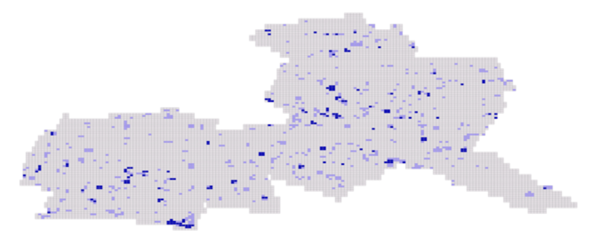
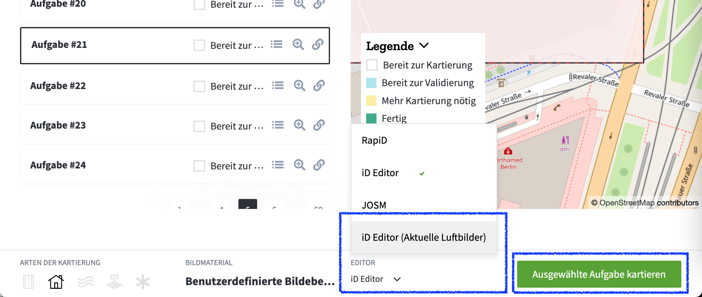

Wir starten in die zweite Phase unseres Experiments mit CrowdMap. In unserem Blogpost Anfang des Jahres haben wir die [Motivation und Chancen](https://www.osm-berlin.org/crowdmap/posts/2024-01-20-crowdmap/) zum diesem Projekt bereits vorgestellt.
Die zentrale Frage, die wir beantworten wollen ist, wie CrowdMap nutzen können, um einen Daten "Layer" von OpenStreetMap – die Gebäude – in Berlin aktuell und gut gepflegt halten können.

## Phase 1: CrowdMap

In Phase 1 haben wir mit Hilfe von **CrowdMap** und einer Handvoll Freiwilliger das Gebiet des Bezirks Friedrichshain-Kreuzberg Kachel für Kachel kontrolliert und Stellen markiert, wo Gebäudedaten in OpenStreetMap aktualisiert werden müssen.
Das Ergebnis ist ein Datensatz ([Rohdaten](https://crowdmap-data.heigit.org/agg_results/agg_results_-NwKCaKQ01geX9s1I3U__geom.geojson.gz)) in dem zu jeder Kachel vermerkt ist, wie viele Nutzer:innen ihn als gut bzw. zu prüfen bewerten.

[Quelle ](https://github.com/osmberlin/www.osm-berlin.org/issues/1)

## Phase 2: Mappen

In Phase 2 geht es jetzt darum, die **Kacheln zu prüfen**, die Nutzer:innen markiert haben.
Dafür haben wir die Rohdaten aus CrowdMap in QGIS aufbereitet, in dem wir sie mit einem kleinen Buffer versehen haben um dann zusammenhängende Kacheln zu Flächen zu verschmelzen.
Jede Fläche ist eine Aufgabe, die wir gemeinsam abarbeiten können. Das passende Tool für diese Form von gemeinsamen Abarbeiten ist der TaskingManager ([OSM Wiki Eintrag](https://wiki.openstreetmap.org/wiki/Tasking_Manager)).

**Im TaskingManger** können wir die Gebiete sehen und angeben, wenn wir an einem Gebiet arbeiten. Am Ende kann man einen öffentlichen Kommentar hinterlassen. Und wenn wir sehr genau sein wollen, könnten wir die zusätzliche 4-Augen-Mechanik nutzen und jede Aufgabe erneut prüfen lassen.

[Auf der Projektseite für unser CrowdMap-Projekt in Xhain](https://tasks.openstreetmap.us/projects/704) findet ihr neben den Gebieten auch rot markierte Bereiche mit hoher Priorität. Das sind die Fläche, die wir als erstes abarbeiten sollten. Sie sind aus Kacheln zusammengesetzt, bei denen sich die Teilnehmer:innen in Phase 1 einig waren, das hier eine Kontrolle nötig ist.

## Bitte mithelfen

Bitte helft mit, die Gebäude in diesen Gebieten zu kontrollieren. Bitte nutzt zum Abgleich vor allem die Luftbilder aus 2024 sowie die ALKIS Daten. Beide Layer könnt ihr nutzen, wenn ihr JOSM verwendet oder den "iD Editor (Aktuelle Luftbilder). Der eingebaut iD Editor hat leider veraltete Luftbilder-Daten und eignet sich daher nicht.

**So kannst du mithelfen:**

1. [Öffnet die Aufgabenliste](https://tasks.openstreetmap.us/projects/704/tasks?page=1)
2. Markiere eine Aufgabe
3. Wähle unten in der Mitte "Editor: iD Editor (Aktuelle Luftbilder) aus dem Dropdown
4. Wähle "Ausgewählte Aufgabe kartieren"
   
5. Im neuen Fenster öffnet sich die Aufgabe. Du kannst das Gebiet als pinke Linie sehen
6. Nutze die "Bildmaterial-Einstellungen" (B) im iD Editor um die Luftbilder aus 2024 bzw. "Berlin/Geoportal ALKIS"-Daten auszuwählen und das Gebiet zu überprüfen
7. Speichere die Änderungen wie immer mit einer sinnvollen Beschreibung (und _erhalte_ die Hashtags)
8. Zurück im Tasking Manager: Hier bitte die Aufgabe (erneut) kommentieren und abschließen

## Ausblick Phase 3: Auswertung

Wenn alle Gebiete aktualisiert sind, haben wir vor, die Kommentare im Tasking Manager auszuwerten um zu bewerten, wie gut das Projekt geklappt hat.

Unser aktueller Eindruck ist, dass der Ansatz gut funktioniert über CrowdMap die Gebiete in OSM zu identifizieren, die auf Aktualität kontrolliert werden müssen.

Das größte Potential dabei ist, dass die Aufgaben in CrowdMap (Phase 1) auf von Ehrenamtler:innen durchgeführt werden können, die wenig oder keine Erfahrung mit OSM haben.

Wie gut das skaliert, muss sich noch zeigen.

Eine weitere Erkenntnis des Projektes ist, dass diese Methodik nur für ganz bestimmte Aktualisierungs-Aufgaben sinnvoll ist, nämlich flächige Geometrien für die es einen hochwertigen (aktuellen) Datensatz zum Abgleich gibt. Für Gebäude Daten also ein toller Workflow, aber für viele andere Szenarien braucht es anders Tooling.

## Mappen

Jetzt heißt es aber erstmal: [Auf zum Mappen…](https://tasks.openstreetmap.us/projects/704)
